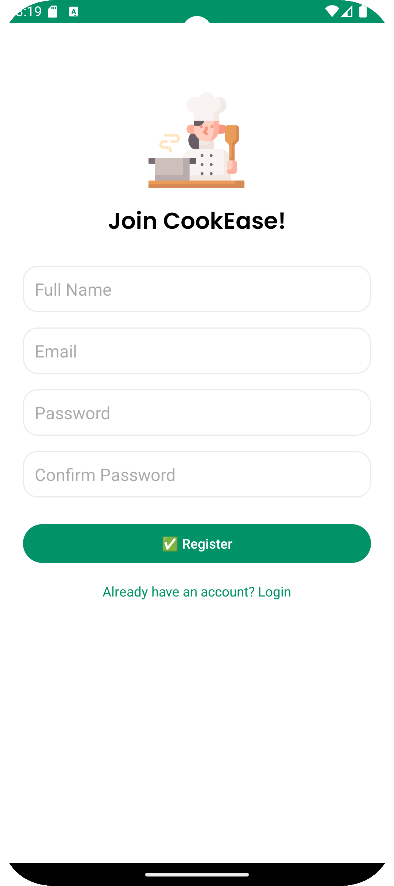
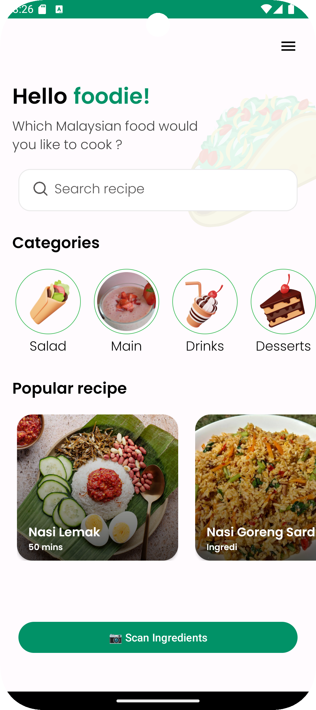
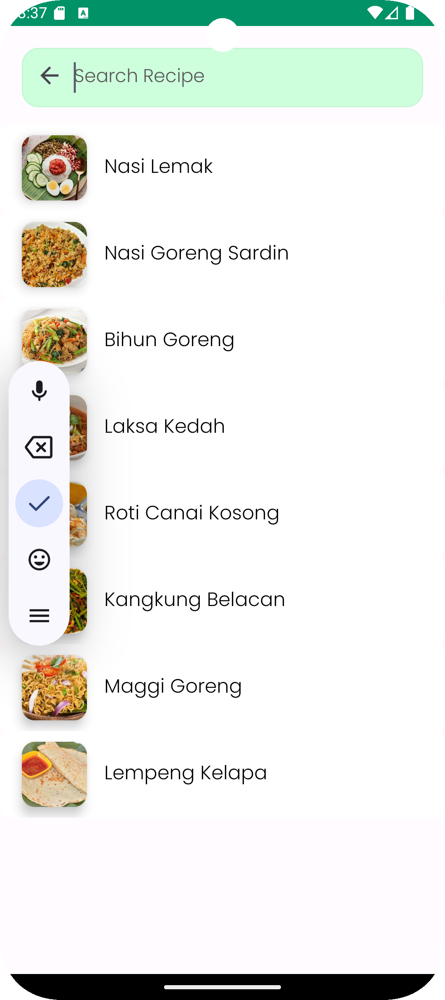
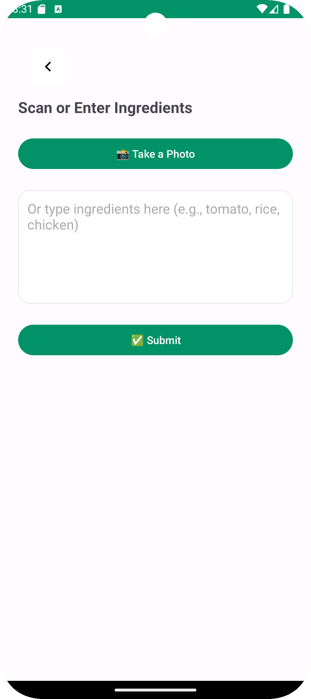
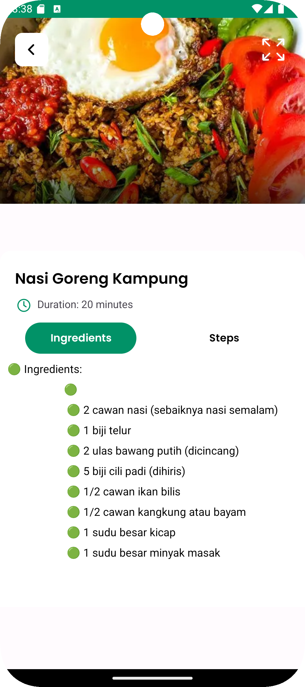
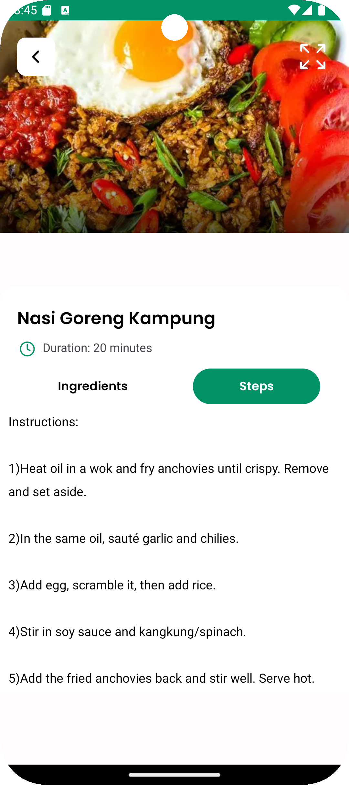

# CookEase

A recipe app I built for my final year project. The idea is simple, instead of searching recipes by name, you search by what ingredients you already have by using ingredient name search or camera to detect what type of ingredient you have.

Built with Kotlin for Android.

## Screenshots

  
  
  
  
  
  

## What it does

- Sign up / login (using Firebase Auth)
- Browse recipes on the home page, sorted by category
- Search for recipes
- View full recipe details (ingredients, description, steps)
- Recipes are stored locally using Room/SQLite so you can browse without internet
- Ingredient scanning using a TensorFlow Lite model — this part is still a work in progress, right now the button just shows a "coming soon" message, the actual camera + ML part isn't fully connected yet

## Tech stack

- Kotlin
- XML for layouts
- Firebase Authentication
- Room (SQLite) for local storage
- TensorFlow Lite for the ingredient recognition model
- Glide for loading images

## Project structure

- `LoginActivity` / `RegisterActivity` – login and signup screens
- `HomeActivity` – main homepage
- `CategoryActivity` / `SearchActivity` – browsing and searching recipes
- `RecipeActivity` – recipe details page
- `ScanIngredientsActivity` – where the ingredient scanning feature will live
- `AppDatabase` / `Dao` / `Recipe` – the Room database setup

## How to run it

1. Clone this repo and open it in Android Studio
2. You'll need your own `google-services.json` file from Firebase (create a project, register an Android app with package name `com.practice.recipesapp`, and download the file into the `app/` folder)
3. Let Gradle sync, then run it on an emulator or your phone

## Still working on

- Adding a favorites/bookmark feature
- Adding more recipes to the database

## Note

This was originally built following a tutorial as a starting point to learn Android development, then I extended it with my own features (Firebase auth, Room database, and the TensorFlow Lite ingredient scanning idea) for my capstone project.
